# Top 14 Best VPN Services in 2025

Your internet provider tracks every website you visit, streaming platforms restrict content based on your location, and public WiFi networks expose your passwords to anyone nearby. A quality VPN service encrypts your connection, masks your real IP address, and lets you browse without constant surveillance from governments, corporations, or hackers. This guide breaks down fourteen VPN providers that actually deliver on privacy promises, covering everything from budget-friendly options with unlimited devices to premium services with audited no-logs policies.

***

## **[ZoogVPN](https://zoogvpn.com)**

Greece-based privacy service offering both free and premium plans with military-grade encryption and servers across 90+ countries worldwide.

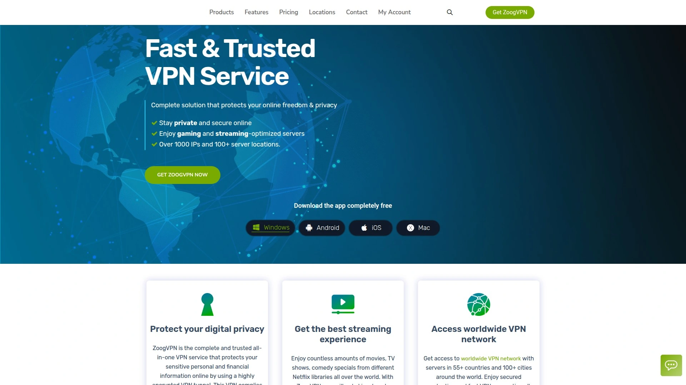

ZoogVPN positions itself as a trustworthy solution for users who need solid privacy protection without breaking the bank. The service operates from Greece, which sits outside the intrusive 14-Eyes surveillance alliance, giving them legal freedom to maintain their strict no-logs policy. They employ bank-grade AES-256 encryption combined with 4096-bit RSA keys—the same security standards financial institutions use to protect transactions. Even with unlimited computing power, cracking this encryption would take millions of years.

The company maintains physical servers in over 90 countries, ensuring you can find nearby connections for optimal speeds. Their proprietary ZoogShadowing technology disguises VPN traffic to look like regular web browsing, letting you bypass network restrictions that actively block VPN connections. This proves especially useful when accessing streaming services or getting around workplace firewalls.

Security features include a kill switch that instantly cuts internet access if your VPN connection drops, preventing accidental data exposure. DNS leak protection keeps your real location hidden even if something goes wrong. Split tunneling lets you choose which apps route through the VPN while others connect normally, giving you control over bandwidth usage.

ZoogVPN supports torrenting through designated P2P-friendly servers optimized for file sharing. These specialized servers handle large data transfers without throttling speeds or imposing restrictions. The service includes Smart DNS functionality for streaming without the typical speed reduction VPNs cause. Users report successfully accessing Netflix, BBC iPlayer, Hulu, and other geographically restricted platforms.

The free plan offers genuinely usable service with 10GB monthly data and access to five server locations. Premium subscriptions unlock the full server network, unlimited bandwidth, and connections for up to five devices simultaneously. SOCKS5 proxy support adds another privacy layer, letting you route specific applications through secure tunnels while maintaining VPN encryption on everything else.

***

## **[NordVPN](https://www.nordvpn.com)**

Industry leader with 8,200+ servers across 120+ countries, proprietary protocols, and consistently perfect performance scores in independent testing.

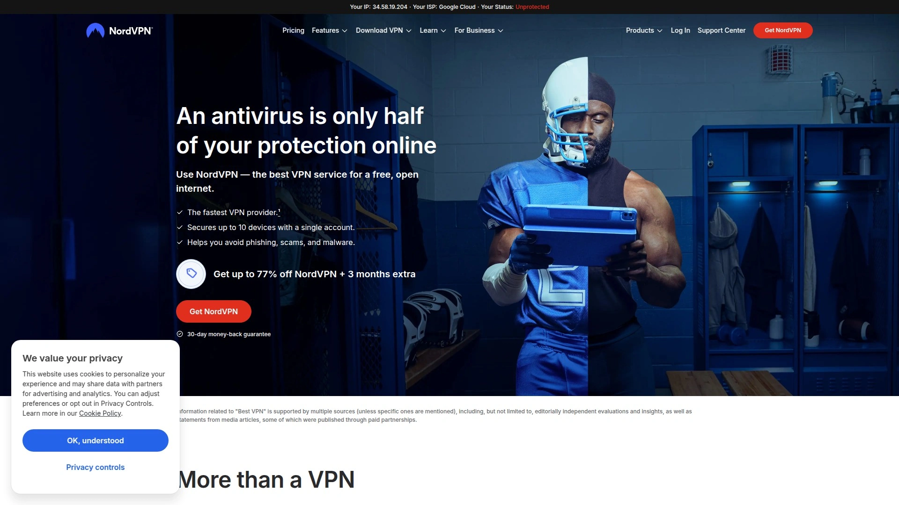

NordVPN dominates the VPN space through relentless innovation and flawless execution. The service operates over 8,200 servers spread across more than 120 countries, providing unprecedented global coverage. Their proprietary NordLynx protocol builds on WireGuard technology while adding enhanced privacy protections. For users in heavily censored regions, NordWhisper protocol specifically bypasses the most restrictive network filters.

Security measures go beyond standard offerings with double VPN servers that route traffic through two separate locations for twice the encryption. Onion over VPN integration sends connections through multiple Tor network nodes, maximizing anonymity at the cost of speed. The company's no-logs policy undergoes third-party audits annually—more frequently than any competitor.

Independent speed tests consistently show NordVPN delivering the smallest performance drops when connected. In recent testing, download speeds decreased by only 5.78% while upload speeds dropped just 4.11%—remarkable results that often beat unencrypted connections. The service reliably unblocks streaming platforms like Netflix with a single click, using SmartPlay technology that combines VPN security with Smart DNS speed.

Threat Protection actively blocks malware, trackers, and intrusive ads at the network level. Meshnet functionality, available free even to non-subscribers, lets you access your home network remotely while bypassing streaming service password-sharing restrictions. NordVPN supports ten simultaneous connections and includes bonus features like a password manager, data breach scanner, and file encryption tool.

***

## **[Surfshark](https://www.surfshark.com)**

Budget champion allowing unlimited simultaneous device connections with double VPN servers and consistently fast speeds across 100 countries.

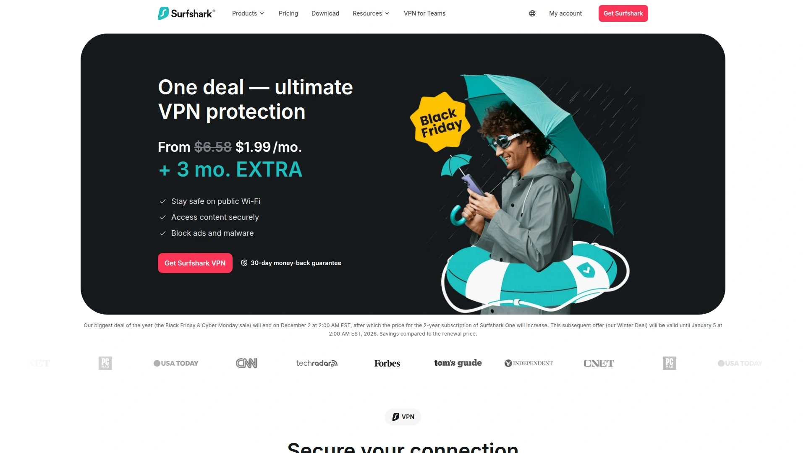

Surfshark earns recognition for packing premium features into affordable subscriptions. The most compelling advantage? Truly unlimited device connections on a single account. Families or users with multiple gadgets never need to choose which devices get protection.

The service operates 3,200+ servers spanning 100 countries, providing extensive geographic coverage. Speed testing reveals Surfshark significantly outperforms competitors on most connections, with download speeds averaging 637-752 Mbps depending on server location. These results beat many pricier alternatives and deliver smooth streaming without buffering.

Double VPN functionality routes connections through two servers instead of one, doubling encryption layers. Traffic obfuscation masks the fact that you're using a VPN, helping bypass network restrictions. All servers support torrenting without limitations, unlike some providers that restrict P2P traffic to specific locations.

Surfshark's jurisdiction in the Netherlands ensures strong privacy protections under EU law. The verified no-logs policy means they collect zero information about your browsing habits, timestamps, or connection details. CleanWeb technology blocks ads, trackers, and malicious websites before they load. For serious privacy situations, Surfshark offers servers that rotate your IP address continuously, making tracking nearly impossible.

The pricing undercuts nearly every competitor while delivering comparable or superior performance. Plans start at $1.99 monthly with long-term commitments, making this the most economical option for users who want quality without compromise.

***

## **[Proton VPN](https://www.protonvpn.com)**

Swiss privacy specialist from the creators of Proton Mail, featuring the best free VPN tier and 12,000+ servers optimized for speed.

Proton VPN comes from the same Swiss team behind Proton Mail, bringing serious privacy credentials to the VPN market. Switzerland's strong data protection laws provide legal backing for their commitment to user privacy. The service operates an impressive 12,000+ servers across 117 countries—more locations than most competitors.

The free tier stands out as genuinely usable rather than a limited trial. Free accounts get unlimited bandwidth (unusual for free VPNs), access to servers in three countries, and support for one device. This makes Proton VPN the best option for users who need occasional VPN access without monthly fees.

Paid subscriptions unlock the full server network and additional privacy tools. Secure Core architecture routes connections through privacy-friendly countries before reaching your destination, protecting against network monitoring. NetShield ad blocker strips tracking scripts and malicious content at the DNS level. Proton VPN integrates seamlessly with other Proton services including encrypted email, calendar, and cloud storage.

Speed performance varies by location but remains competitive. Recent testing showed 524-698 Mbps depending on server distance, with especially strong results on long-distance European connections at 614 Mbps. The open-source apps undergo regular independent audits, confirming they function exactly as advertised with no hidden tracking.

The company maintains a verified no-logs policy—they physically cannot hand over browsing history because they don't collect it. All paid plans support ten simultaneous connections, allowing coverage for entire households. For users prioritizing privacy above all else, Proton VPN's Swiss location and proven track record make it a top choice.

***

## **[ExpressVPN](https://www.expressvpn.com)**

Premium speed-focused service with proprietary Lightway protocol, post-quantum encryption, and servers in 105 countries.

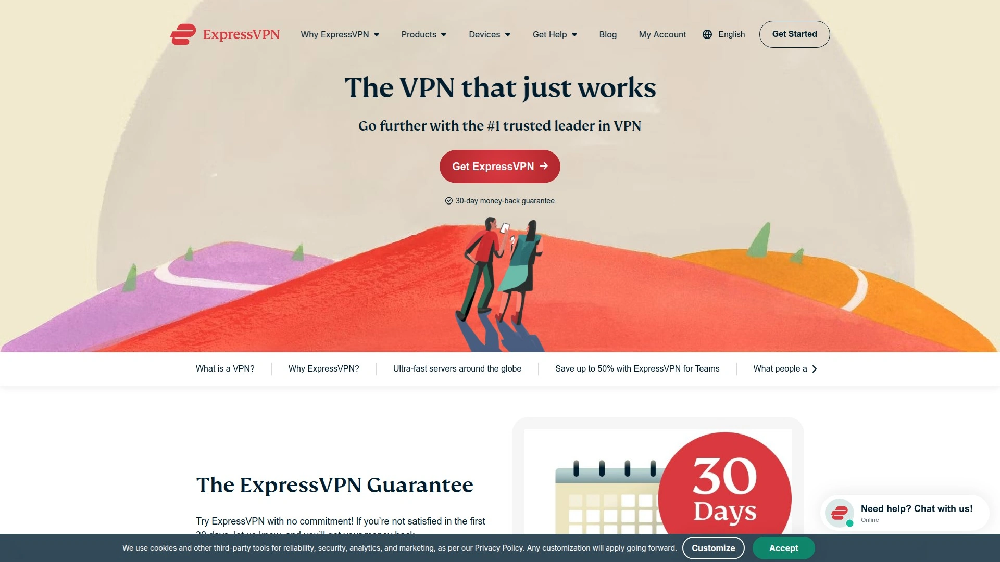

ExpressVPN justifies premium pricing through exceptional performance and cutting-edge security. The service maintains servers in 105 countries—broader geographic coverage than most alternatives. Their custom Lightway protocol uses the open-source WolfSSL cryptography library and has passed three independent audits by KPMG, proving its security claims.

What sets ExpressVPN apart? Post-quantum encryption that protects against future hacking methods before they even exist. As quantum computers advance, they'll potentially crack current encryption standards in seconds. ExpressVPN's forward-looking approach ensures connections remain secure for decades, not just today.

Speed tests consistently show strong results across all server locations. The interface wins praise for its intuitive design—even VPN beginners connect successfully on their first try. ExpressVPN reliably bypasses geographic restrictions on streaming platforms, making it popular among users accessing international content libraries.

The downsides? No free tier exists, so you must commit to a paid subscription. Monthly and annual plans cost more than budget alternatives, though long-term subscriptions bring prices down. The service also lacks multi-hop connections that route through multiple servers simultaneously.

Ad blocking functionality works but shows inconsistency compared to specialized solutions. Five simultaneous connections come standard, which suffices for individuals but falls short for large families. Despite these limitations, ExpressVPN delivers reliable, fast, and secure connections that justify the premium for users who prioritize performance.

---

## **[Private Internet Access](https://www.privateinternetaccess.com)**

User-friendly VPN ideal for beginners, offering unlimited connections and servers across 91 countries with transparent privacy practices.

Private Internet Access (PIA) removes complexity from VPN usage while maintaining strong security. The interface simplifies connection to the point where even tech-phobic users succeed immediately. This beginner-friendly approach doesn't sacrifice features—PIA includes all standard VPN functionality plus thoughtful extras.

The service provides unlimited simultaneous connections, meaning every device you own gets protection under one subscription. Server coverage spans 91 countries, offering solid geographic diversity. Speed testing shows excellent download performance with only 4.84% speed loss, though upload speeds drop significantly at 84.26%.

PIA's independently audited privacy policy confirms their no-logs claims. The company publishes transparency reports detailing any government requests they receive. Open-source applications let security researchers verify the code matches their privacy promises.

Protocol support includes OpenVPN, WireGuard, and IKEv2, giving you options for different use cases. Split tunneling lets you route specific apps through the VPN while others connect directly. MACE technology blocks ads, trackers, and malware at the DNS level before content loads.

Pricing remains competitive with budget options, especially during promotional periods. Customer support responds quickly to technical questions. The main weakness? Upload speeds suffer more than competitors when connected, which matters for video calls or cloud backup operations. For basic browsing, streaming, and downloads, PIA delivers excellent value with minimum learning curve.

---

## **[CyberGhost](https://www.cyberghostvpn.com)**

Streaming-optimized service with 11,500+ servers, dedicated profiles for specific platforms, and automatic best-server selection.

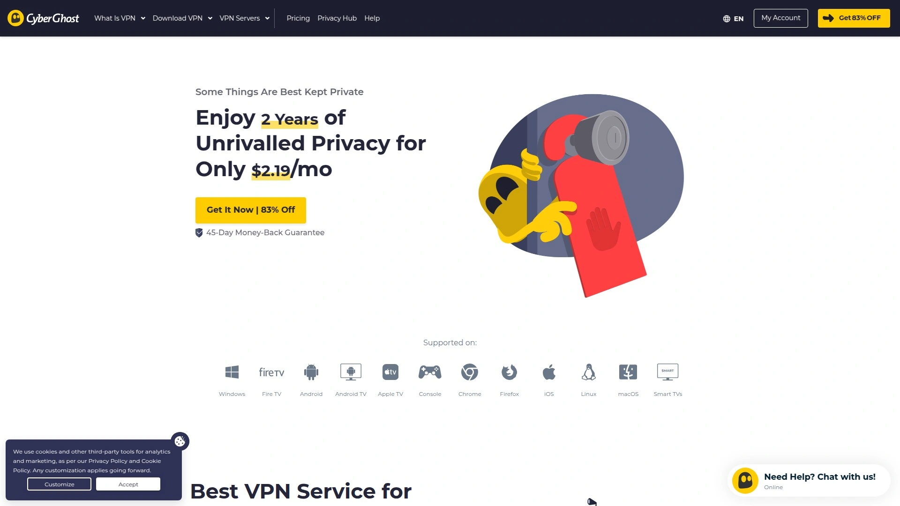

CyberGhost focuses heavily on streaming and content access. The service operates one of the largest server networks at 11,500+ locations globally. Instead of manually choosing servers, CyberGhost offers pre-configured profiles optimized for specific streaming platforms, torrenting, or gaming.

This specialized approach means clicking "Netflix US" automatically connects you to servers proven to unblock American Netflix content. Similar profiles exist for BBC iPlayer, Hulu, Disney+, and other popular platforms. The company maintains these working connections by constantly testing and updating server configurations.

Security features include military-grade encryption, automatic kill switch, and DNS leak protection. The no-logs policy underwent independent verification. CyberGhost's jurisdiction in Romania provides strong privacy protections outside major surveillance alliances.

Seven simultaneous connections come standard, supporting multiple users or device types. The interface works well on desktop but mobile apps sometimes feel cluttered with options. Customer support offers 24/7 live chat in multiple languages.

Speed performance varies—streaming-optimized servers deliver excellent results while general servers show more inconsistency. For torrenting, dedicated P2P servers provide fast downloads with clear indicators showing which locations permit file sharing. The company allows torrenting on all servers, unlike some competitors that restrict P2P activity.

Long-term subscriptions cost significantly less than monthly plans, with promotional pricing often dropping below $3 per month. The 45-day money-back guarantee exceeds the industry standard 30 days, giving ample time to test performance. CyberGhost succeeds for users who primarily want reliable streaming access without technical configuration.

---

## **[Windscribe](https://windscribe.com)**

Feature-rich VPN with exceptional ad-blocking, built-in R.O.B.E.R.T. filtering system, and generous 10GB monthly free tier.

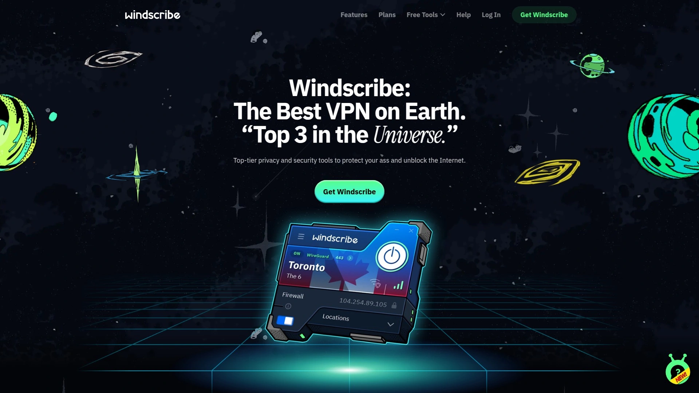

Windscribe takes a different approach by building advanced privacy tools directly into their VPN service. The standout feature? R.O.B.E.R.T.—Remote Omnidirectional Badware Eliminating Robotic Tool. This customizable filter blocks ads, trackers, malware, social networks, gambling sites, clickbait, cryptocurrency, and even other VPNs.

Unlike basic ad blockers, R.O.B.E.R.T. operates at the DNS level before content reaches your device. You create custom whitelists and blacklists for specific domains or IP addresses, giving granular control over what gets blocked. The proxy browser extension adds user agent spoofing, GPS location spoofing, and browser timezone masking to prevent digital fingerprinting.

The free plan provides 10GB monthly data—enough for regular browsing but not streaming. Paid subscriptions unlock unlimited data and access to servers in 130+ locations. Windscribe's Firewall Mode functions as a kill switch, preventing any unencrypted data from leaving your device if the VPN connection fails.

Speed testing shows solid performance on nearby servers with 10Gbps capacity. The service supports split tunneling, letting you choose which applications use the VPN. WebRTC leak protection comes standard, addressing a common privacy vulnerability that exposes real IP addresses even when VPNs are active.

Windscribe maintains a strict no-logs policy verified through independent audits. The company operates transparently with clear privacy documentation. Customer support responds through ticket systems rather than live chat, which works fine for non-urgent issues.

The pricing sits in the middle range—not the cheapest but reasonable for the feature set. Windscribe particularly appeals to privacy enthusiasts who want extensive customization options and don't mind spending time configuring settings.

---

## **[Hotspot Shield](https://www.hotspotshield.com)**

Free VPN with proprietary Hydra protocol delivering the fastest speeds among free options, though limited to 15GB monthly on free tier.

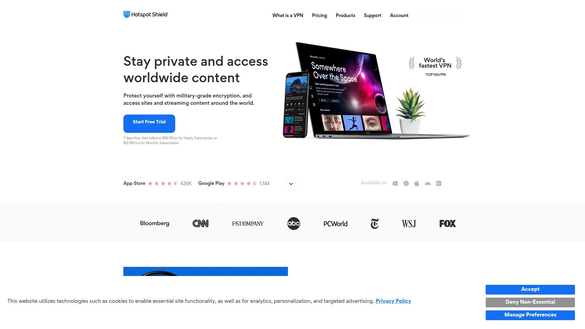

Hotspot Shield earns recognition as the best truly free VPN service. The free tier provides 15GB monthly data—double what most free VPNs offer. Speed testing reveals remarkable results with only 3.17% download speed loss, beating even premium services. This makes Hotspot Shield ideal for users who need occasional VPN access without subscriptions.

The proprietary Hydra protocol optimizes for speed rather than maximum security. This trade-off delivers noticeably faster connections than competitors using standard protocols. For streaming, browsing, and general use, the speed advantage outweighs theoretical security differences.

Free accounts connect through servers in one location, while paid subscriptions unlock 85 countries. The interface works smoothly across platforms with straightforward connection buttons. Ten simultaneous connections come with paid plans, sufficient for most households.

The verified no-logs policy underwent independent auditing. Hotspot Shield includes malware protection and phishing site blocking built into connections. Split tunneling allows routing specific apps through the VPN while others connect normally.

Upload speeds drop more significantly at 80% when connected, similar to many VPN services. The free version displays ads, which subsidizes the service but interrupts browsing occasionally. Paid subscriptions remove ads and add priority customer support.

For users wanting reliable free VPN service for light usage, Hotspot Shield delivers exceptional value. The speed performance rivals paid competitors, making this the logical starting point before committing to subscriptions.

---

## **[TunnelBear](https://www.tunnelbear.com)**

Approachable VPN with charming interface design, straightforward privacy policy, and 500MB monthly free data for casual users.

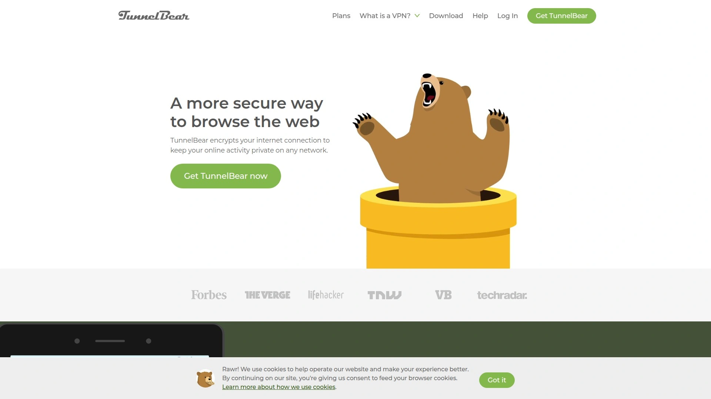

TunnelBear stands out through exceptional ease of use wrapped in playful bear-themed design. The interface removes intimidating technical jargon, replacing it with friendly language anyone understands. Connection happens by dragging a virtual bear to your desired country on an animated map.

The free plan offers 500MB monthly data—enough to test the service but not for daily use. Paid subscriptions provide unlimited data and access to servers in 49 countries. The server count trails competitors, but coverage includes all major regions.

TunnelBear's privacy policy wins praise for clarity and brevity. They explain exactly what they collect (almost nothing) in plain English instead of legal jargon. Independent security audits verify the apps function as promised with no hidden tracking.

GhostBear mode obfuscates VPN traffic to bypass network restrictions that block VPN connections. VigilantBear acts as a kill switch, blocking internet access if your VPN drops. The company maintains strict no-logs policies and publishes transparency reports.

Speed performance falls in the middle range—not the fastest but adequate for browsing and moderate streaming. Customer support operates through email rather than live chat, with generally helpful responses. The main limitation? Small monthly data allowances on free accounts require careful usage monitoring.

TunnelBear succeeds brilliantly for VPN beginners who feel overwhelmed by technical interfaces. The approachable design and generous free trial let you understand how VPNs work before spending money.

***

## **[Mullvad VPN](https://mullvad.net)**

Privacy-maximalist service requiring zero personal information, accepting cash payments, and featuring anonymous account numbers instead of email logins.

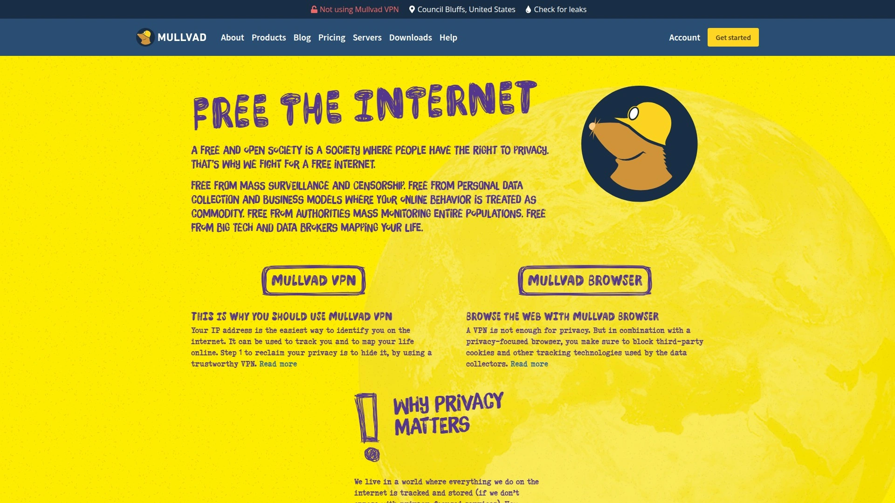

Mullvad takes privacy to extreme levels by eliminating any connection between you and your account. Registration requires no email address, no name, nothing. You generate a random account number, pay for service, then log in using only that number. The company accepts cash payments sent by mail and cryptocurrency, allowing completely anonymous subscriptions.

The no-logs policy has undergone three independent security audits from Radically Open Security, Assured AB, and Atredis Partners. The most recent 2023 audit examined their entire infrastructure and confirmed Mullvad stores absolutely nothing about user activities—no IP addresses, bandwidth usage, DNS requests, or timestamps.

Sweden jurisdiction raises eyebrows since it belongs to the 14-Eyes surveillance alliance, but Mullvad's technical implementation prevents them from having any data to hand over even if compelled. All servers run on RAM that automatically wipes on restart. Post-quantum encryption protects connections against future cryptographic attacks.

The service operates at a flat rate—€5 monthly with no discounts for longer commitments. This simplified pricing removes the complexity of tiered plans. Mullvad supports five simultaneous connections per account.

MultiHop bridge mode routes traffic through multiple VPN servers for maximum anonymity. DNS-based ad and tracker blocking comes standard. Split tunneling works on Linux and Android. The permanent kill switch prevents any unencrypted traffic from leaving your device.

Streaming performance proves limited—Mullvad doesn't optimize for unblocking geographic restrictions. The service focuses purely on privacy rather than content access. For users who prioritize anonymity over convenience, Mullvad represents the gold standard.

***

## **[IVPN](https://www.ivpn.net)**

Audited open-source VPN from Gibraltar with AntiTracker functionality, hardcore privacy mode, and quantum-resistant encryption keys.

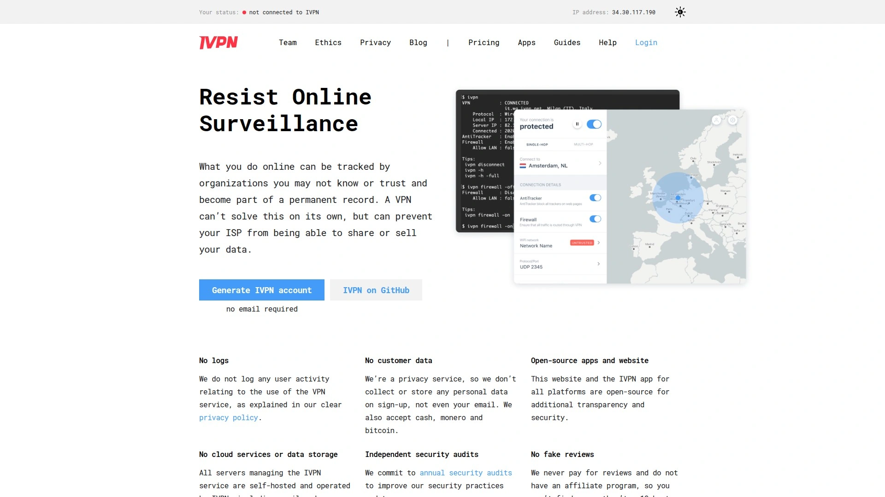

IVPN competes directly with Mullvad in the privacy-focused niche. Like Mullvad, IVPN requires no email for registration—just a generated account number and payment. They accept cash and cryptocurrency for anonymous subscriptions.

Gibraltar jurisdiction provides better privacy protections than most European locations. While Gibraltar belongs to the UK, its offshore status keeps it outside the 5-Eyes surveillance alliance that monitors internet traffic. The company underwent two independent audits from Cure53, one of the most respected security firms that also audited ExpressVPN and Surfshark.

AntiTracker blocks ads and tracking scripts at the network level. Hardcore mode takes this further by blocking connections to websites owned by major surveillance companies like Google and Meta. This extreme privacy mode breaks some websites but maximizes anonymity.

IVPN supports two-factor authentication for account security. The system-wide firewall acts as an ultimate kill switch, preventing any internet access if VPN connection drops. Multi-hop routing sends traffic through multiple servers in different countries. Obfsproxy disguises VPN traffic to bypass network restrictions.

Quantum-resistant pre-shared keys protect against future decryption attempts even as quantum computers advance. This forward-thinking security ensures today's encrypted traffic remains private decades from now. Open-source clients let security researchers verify the code contains no backdoors.

Pricing runs higher than budget options—IVPN positions itself as a premium privacy service. Standard plans support two simultaneous connections while Pro accounts allow seven devices. Streaming capabilities remain limited since IVPN focuses on privacy over content access. For users whose threat model requires maximum anonymity, IVPN delivers professional-grade protection.

***

## **[PureVPN](https://www.purevpn.com)**

Versatile all-in-one security platform with quantum-resistant encryption, 20Gbps servers, and bundled password manager plus file encryption tools.

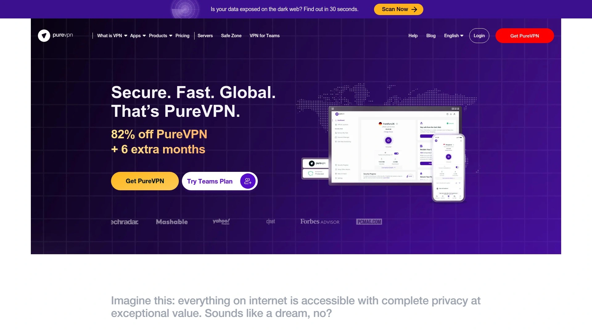

PureVPN positions itself as a comprehensive security solution beyond basic VPN functionality. The service stands as one of few quantum-resistant VPNs on the market, preparing for future threats before they materialize. This advanced encryption ensures connections remain secure even as computational power increases exponentially.

Server infrastructure operates at 20Gbps capacity, providing room for bandwidth-intensive activities like 4K streaming or large file transfers. The network spans 78+ countries with strong coverage across all continents. Port forwarding support lets you run servers or access devices remotely while maintaining VPN protection.

Protocol selection includes OpenVPN, IKEv2, WireGuard, and IPSec—more options than most competitors. This flexibility lets you optimize for speed, security, or compatibility depending on your situation. Private DNS servers handle all queries, preventing DNS leaks that expose your real location.

PureVPN bundles additional security tools into their ecosystem. PureKeep password manager securely stores login credentials. PureEncrypt protects sensitive files with encryption. PurePrivacy audits your online presence and helps remove exposed personal information. These extras transform PureVPN into an all-in-one privacy platform rather than just a VPN.

The interface works well across devices with intuitive controls. Kill switch protection prevents data leaks if connections drop. Split tunneling routes chosen apps through the VPN while others connect directly. WebRTC leak protection comes standard on browser extensions.

Tor compatibility allows routing VPN traffic through the Tor network for extreme anonymity. Multiport technology switches between different ports if one gets blocked. For users who want comprehensive digital security beyond basic VPN functionality, PureVPN delivers extensive tools in one package.

***

## **[Atlas VPN](https://atlasvpn.com)**

Emerging provider offering SafeSwap rotating IP addresses, MultiHop+ connections, and Data Breach Monitor for leaked credentials.

Atlas VPN brings fresh features to the increasingly crowded VPN market. SafeSwap technology assigns multiple rotating IP addresses simultaneously, making tracking virtually impossible. This goes beyond standard VPN masking by continuously changing your apparent location even during active sessions.

MultiHop+ routes connections through multiple randomly selected server locations. Unlike basic double VPN that uses two fixed servers, MultiHop+ varies the path with each connection for enhanced privacy. This makes patterns harder to detect for anyone attempting traffic analysis.

Data Breach Monitor scans databases for leaked credentials associated with your email address. If your login information appears in a breach, Atlas VPN alerts you immediately so you can change passwords. This proactive security feature helps prevent account compromises before they happen.

SafeBrowser blocks malware, phishing sites, and tracking scripts automatically. The technology operates at the DNS level, preventing threats from reaching your device. Kill switch protection and leak prevention come standard across all platforms.

Atlas VPN supports IKEv2 and WireGuard protocols. While the protocol selection is smaller than some competitors, both options deliver strong security and good speeds. The service uses AES 256-bit encryption and private DNS servers.

One notable limitation—Atlas VPN doesn't offer dedicated IP addresses or port forwarding. Obfuscation features also aren't available, which matters if you need to bypass aggressive VPN blocking. The server network is still expanding, so coverage in some regions remains limited.

Pricing competes well with budget providers, especially during promotional periods. The interface design looks modern and works intuitively. For users wanting innovative features like rotating IPs and breach monitoring, Atlas VPN delivers unique value.

---

## **[Hide.me](https://hide.me)**

No-logs VPN with unique protocol-switching capabilities, generous 10GB monthly free tier, and independently audited privacy claims.

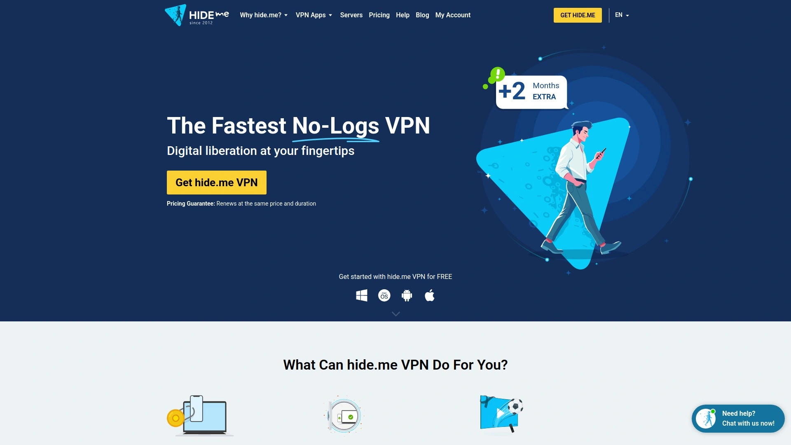

Hide.me emphasizes transparency through multiple independent audits verifying their no-logs claims. The company publishes detailed privacy policies explaining exactly what they collect (essentially nothing) and why. This commitment to openness builds trust in an industry where vague privacy statements remain common.

The free tier provides 10GB monthly data with access to servers in five locations. Unlike many free VPNs that throttle speeds artificially, Hide.me's free accounts connect at the same speeds as paid subscriptions. This makes the free tier genuinely useful for light browsing and occasional secure connections.

Protocol support includes OpenVPN, IKEv2, WireGuard, SoftEther, and SSTP. This extensive selection lets you switch protocols based on your specific needs—WireGuard for speed, OpenVPN for compatibility, or SoftEther for bypassing restrictive firewalls. Most VPNs lock you into two or three protocols, while Hide.me's flexibility proves valuable in challenging network environments.

The service operates under Malaysian jurisdiction, which provides strong privacy protections outside major surveillance alliances. Servers span 75+ locations globally with both physical and virtual options clearly labeled. Hide.me practices transparency about which servers are physical hardware versus virtual locations.

Stealth Guard kill switch prevents unencrypted traffic if your VPN disconnects. Split tunneling works on most platforms, letting you route specific apps through the VPN. The company maintains detailed logging of what they don't log, ironically providing extensive documentation of their non-logging practices.

Customer support responds through ticket systems and live chat depending on subscription tier. Upload speeds remain strong when connected, maintaining performance for video calls and cloud backups. Hide.me succeeds for users who value proven privacy claims and protocol flexibility.

---

## FAQ

**Which VPN works best for streaming Netflix and other geo-restricted content?**

CyberGhost specializes in streaming with dedicated server profiles for specific platforms like Netflix, BBC iPlayer, and Hulu. NordVPN also reliably unblocks content using SmartPlay technology that combines VPN security with Smart DNS speeds. ExpressVPN maintains strong streaming performance across its server network with consistent access to international content libraries. ZoogVPN includes Smart DNS functionality specifically designed for streaming without typical VPN speed reductions.

**Are free VPN services safe to use, and which ones actually work?**

Hotspot Shield offers the best free tier with 15GB monthly data and only 3.17% speed loss. Proton VPN provides unlimited bandwidth on free accounts—extremely rare among free VPNs—with access to servers in three countries. Windscribe and Hide.me both offer 10GB monthly free data with strong privacy policies. ZoogVPN's free plan includes 10GB monthly with access to five server locations. Avoid completely free VPNs that don't offer paid tiers, as they often sell browsing data to advertisers.

**What makes Mullvad and IVPN different from other VPN providers?**

Both Mullvad and IVPN eliminate any connection between your identity and your VPN account by requiring no email, no personal information, and accepting anonymous cash or cryptocurrency payments. They've undergone multiple independent security audits proving their no-logs claims. These services focus exclusively on privacy rather than streaming or content access, making them ideal for users whose threat model requires maximum anonymity. Both also offer quantum-resistant encryption that protects against future decryption attempts.

***

## Conclusion

Choosing the right VPN depends on whether you prioritize streaming access, maximum privacy, budget savings, or user-friendly interfaces. From premium services with post-quantum encryption to generous free tiers with unlimited bandwidth, this list covers every use case and budget level. [ZoogVPN](https://zoogvpn.com) stands out as the ideal balanced choice for users who want strong privacy protections from a non-surveillance jurisdiction, proprietary obfuscation technology for bypassing blocks, and both free and affordable premium options—all while maintaining bank-grade encryption and a verified no-logs policy.
